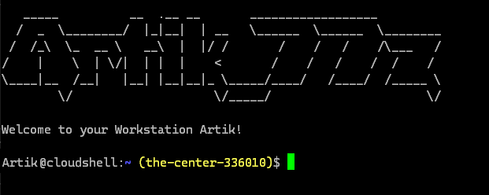

# Google Cloud Computing (GCP) Shell init script
A script to customize the Shell environment.


## Custom Startup Script (.customize_environment)

If you find yourself needing tools or packages that aren't included in the list of packages that Cloud Shell has pre-installed, create a file called .customize_environment in your $HOME directory.

This script is run as root when the VM is created.

You could install packages, make configuration changes or just remove some of the things Google bakes into the image.

When the script completes, the file /google/devshell/customize_environment_done is created. Log output is available at /var/log/customize_environment.

On every login to Cloud Shell, you will see the following:

    Welcome to Cloud Shell. Type "help" to get started.

This is part of the init_help.sh script located at /etc/profile.d/init_help.sh that runs on every login.

If you delete the file, you will notice that Google helpfully recreates it the next time google create a new VM.

Unfortunately, to stop this message appearing on every login we need to delete this file as part of our .customize_environment script.

To remove the /etc/profile.d/init_help.sh script and stop the above two behaviours, add the following to your .customize_environment file:
```
#!/bin/sh

# File to remove
file="/etc/profile.d/init_help.sh"

if [ -f $file ] ; then
    rm $file
fi
```


Note: Deleting this file will also delete the messages that tell you which GCP project you have selected. You can see how to add these back in with the "customise the login message" tip.
Note: This also removes the 'help' alias.
Customise the login message

To add a custom welcome message, you just need to copy in a bash script to /etc/profile.d/ that will get executed on login.

However, when the script runs it does not have access to the $HOME directory so any scripts will need to be hosted externally, like i'm doing right now with github.

Add code similar to this to your .customize_environment file:
```
#!/bin/sh
echo 'Getting custom login message script...'
wget -P /etc/profile.d/ https://URL/path/to/your/init_welcome.sh
chmod +x /etc/profile.d/init_welcome.sh
```

Note: Replace URL/path/to/your/init_welcome.sh script with a publicly accessible bash script.

## Result:

